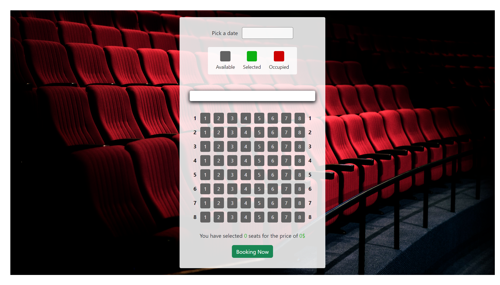
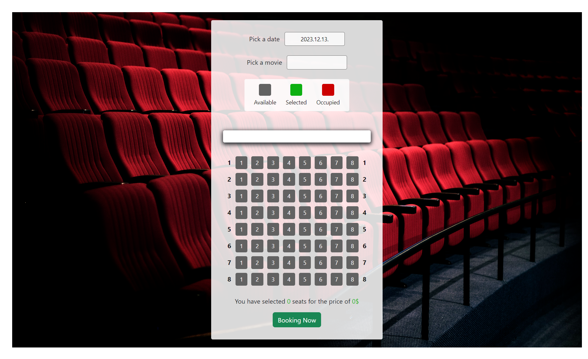
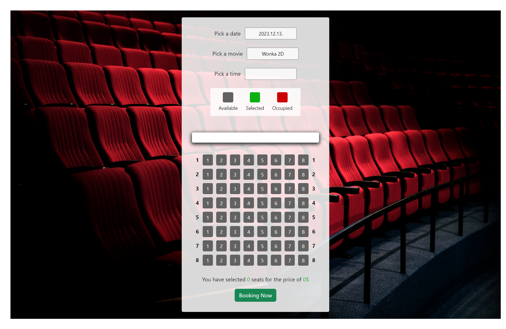
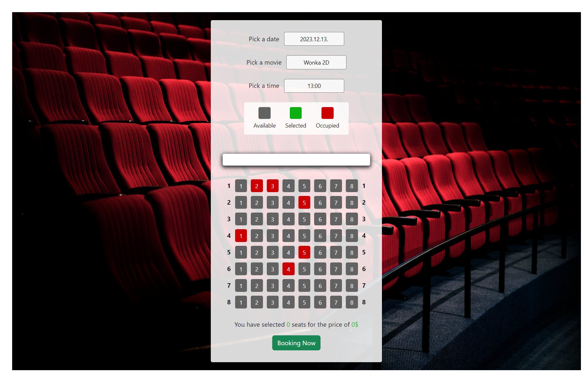
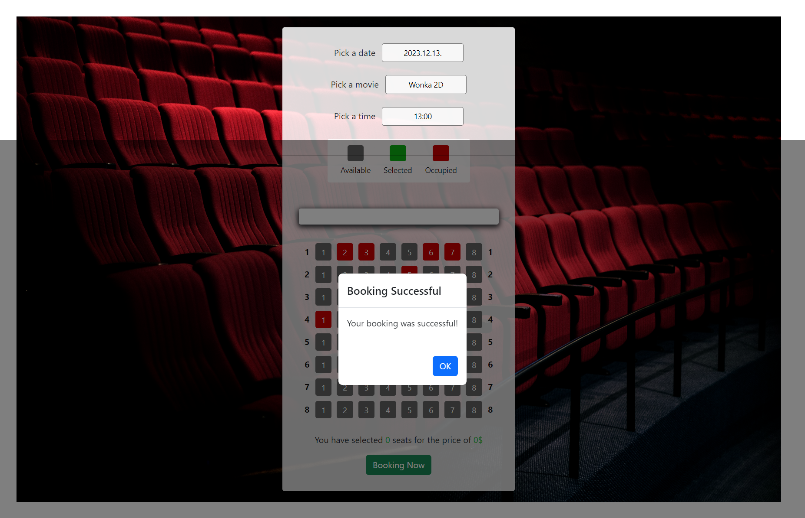

# Movie Ticket Booking Application

This is a simple Angular application for booking movie tickets. Users can select a date, choose a movie, pick a showtime, and select seats for booking.
 

## Features

- Date Selection: Users can pick a date from the available options.
 

- Movie Selection: Once a date is selected, users can choose from the list of available movies.
 
 
- Showtime Selection: After selecting a movie, users can pick a showtime.
 

- Seat Booking: Users can choose seats for booking. The application provides a visual representation of available, selected, and occupied seats.
 
 
- Price Calculation: The total price is calculated based on the selected seats and the corresponding showtime prices.
 
 
- Booking Confirmation: Users can confirm their booking, and the application displays a modal with the booking status.
 

## Components

The application is built using Angular and includes the following components:

- Date Component: Allows users to pick a date.
- Movies Component: Displays a list of movies for the selected date.
- Time Component: Enables users to choose a showtime for the selected movie and date.
- Cinema Component: Represents the cinema hall with seat selection functionality.
- Showcase Component: Displays a legend for seat status (available, selected, occupied).
- Modal Component: A modal for displaying alerts and messages.
- App Component: The root component that manages the overall state and interactions.

## Services

- AlertService: A service for displaying modal alerts.

## Getting Started

1. Clone the repository. (git clone https://github.com/PetraHajdu/movie-ticket-booking.git)
2. Install dependencies.
3. Run the application (ng serve).
4. Open in browser: Visit http://localhost:4200/ in your browser.

## Usage

1. Open the application in your browser.
2. Select a date, movie, and showtime.
3. Choose seats for booking.
4. Confirm your booking.
5. View the booking status in the modal.

